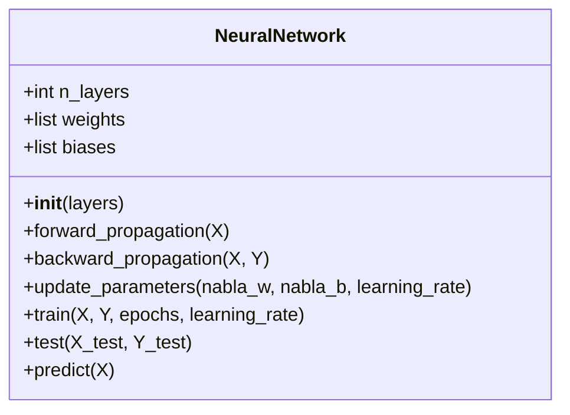
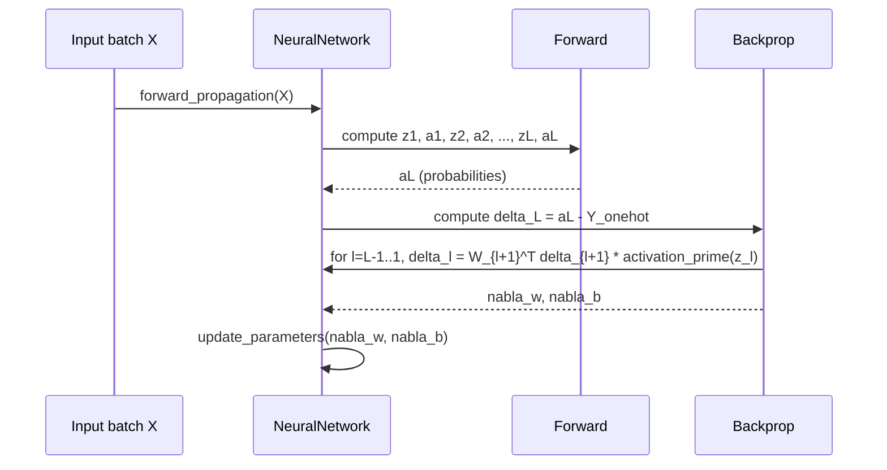

# Neural Networks From Scratch

> A compact, professional README for the Jupyter notebook that implements a simple feed-forward neural network from scratch (NumPy only). Includes architecture description, usage, design notes and mermaid diagrams that explain data flow and algorithmic steps.

---

## Table of Contents

1. [Project Overview](#project-overview)
2. [Quickstart](#quickstart)
3. [Repository / Notebook Structure](#repository--notebook-structure)
4. [Core Components Explained](#core-components-explained)
   - Data loaders
   - Activation functions
   - `NeuralNetwork` class
   - Training loop (forward / backward / update)
5. [Mermaid diagrams](#mermaid-diagrams)
6. [Design decisions & numerical notes](#design-decisions--numerical-notes)
7. [How to extend / next steps](#how-to-extend--next-steps)
8. [Dependencies](#dependencies)
9. [License & attribution](#license--attribution)

---

## Project Overview

This project implements a simple fully-connected feed-forward neural network **from scratch** using only NumPy and Matplotlib. The notebook demonstrates:

- Loading raw MNIST `idx` format images and labels.
- Typical activation functions (sigmoid, ReLU, softmax) and their derivatives.
- A `NeuralNetwork` class with Xavier-style initialization, forward propagation, backpropagation, parameter updates, and evaluation (loss + accuracy).
- Training/visualisation loops that plot loss & accuracy.

It is intended as an educational reference to understand the algorithmic building blocks of small neural networks prior to using high-level frameworks such as PyTorch or TensorFlow.

---

## Quickstart

1. Create a Python virtual environment and install dependencies:

```bash
python -m venv .venv
source .venv/bin/activate   # on Windows use: .venv\Scripts\activate
pip install -r requirements.txt
```

2. Place the MNIST `idx` files in `archive/` (same paths used in the notebook), then open the notebook:

```bash
jupyter lab  # or jupyter notebook
```

3. Run cells in order: data loading → visualisation → create `NeuralNetwork` → `train(...)` → `test(...)` → `predict(...)`.

---

## Repository / Notebook Structure

```
notebook.ipynb                 # The provided notebook
archive/                       # MNIST idx files (train/test images and labels)
requirements.txt               # minimal dependencies (numpy, matplotlib)
README.md                      # this file
```

---

## Core Components Explained

### Data loaders

Functions: `load_mnist_images(filename)` and `load_mnist_labels(filename)`

- They read the original MNIST `IDX` binary format with `struct.unpack` and `np.frombuffer`.
- Images are returned as `(num_samples, 784)` arrays of type `uint8` and normalized to `[0, 1]` before training.
- Notebook transposes the data to shape `(784, num_samples)` for matrix-multiplication style forward passes.


### Activation functions

Implemented activations:

- `sigmoid(z)` and `sigmoid_prime(z)` — classic logistic activation.
- `relu(z)` and `relu_prime(z)` — piecewise linear activation and derivative.
- `softmax(z)` — numerically stabilised softmax (subtract `max` per column).
- `one_hot(Y, num_classes)` — converts integer labels to one-hot columns used in cross-entropy.

**Note:** Softmax is applied on the final-layer logits; cross-entropy loss is computed between one-hot ground-truth and predicted probabilities.


### `NeuralNetwork` class (high level)

The class encapsulates the model and training routines. Key fields & methods:

```python
class NeuralNetwork:
    def __init__(self, layers):
        # layers: e.g. [784, 128, 10]
        self.weights  # list of weight matrices
        self.biases   # list of bias column-vectors

    def forward_propagation(self, X):
        # Returns list of activations and pre-activation zs for each layer

    def backward_propagation(self, X, Y):
        # Computes gradients for weights and biases via backprop

    def update_parameters(self, nabla_w, nabla_b, learning_rate):
        # Simple SGD parameter update

    def compute_loss(self, Y, Y_hat)
    def compute_accuracy(self, X, Y)
    def train(self, X, Y, epochs, learning_rate)
    def test(self, X_test, Y_test)
    def predict(self, X)
```

**Forward pass**: hidden layers use ReLU, output layer uses softmax. The network stores both `activations` and `zs` (pre-activation values) to compute derivatives efficiently during backprop.

**Backpropagation**: the notebook uses the standard chain rule: error at output `delta = a_L - y_onehot` for softmax+cross-entropy, then propagates backwards using `W.T @ delta * activation_prime(z)` for each layer.


### Training loop

- A single `train` call repeatedly computes gradients on the entire training set (plain-batch gradient descent as implemented). The example uses the whole training set per update (you can convert to mini-batches easily).
- After each epoch the notebook computes and records loss and accuracy, and finally plots both curves.

---

## Mermaid diagrams

### 1) High level data flow

```mermaid
flowchart LR
  A[Raw MNIST IDX files] --> B[load_mnist_images / load_mnist_labels]
  B --> C[Preprocess: normalize, reshape, transpose]
  C --> D[NeuralNetwork instance]
  D --> E[train(X, Y)]
  E --> F[forward_propagation]
  F --> G[backward_propagation]
  G --> H[update_parameters]
  H --> E
  E --> I[test(X_test, Y_test)]
  I --> J[metrics & plots]
```


### 2) Class diagram (simplified)




### 3) Forward + Backprop sequence (per training iteration)



---

## Design decisions & numerical notes

- **Initialization** — Xavier/Glorot-like scaling `np.random.randn(...) * np.sqrt(1 / fan_in)` is used. For ReLU activations He-initialization (`sqrt(2/fan_in)`) is often preferred.

- **Learning rate & optimizer** — The notebook implements vanilla Gradient Descent (full-batch). To improve convergence use mini-batches + Adam or momentum.

- **Stability** — Softmax implements `z - max(z)` for numerical stability.

- **Batching** — The current implementation uses the entire dataset for each gradient step. Switch to minibatching for speed and better generalisation.

- **Loss smoothing** — add weight decay (L2) or early stopping to avoid overfitting.

---

## How to extend / next steps

- Add mini-batch training (shuffle, split batches, iterate).
- Replace manual learning-rate updates with Adam or RMSProp.
- Add dropout, batch-normalization.
- Convert to convolutional layers (a larger change) and compare results to classic FC net.
- Add model saving / loading with `np.save` / `np.load` for weights and biases.

---

## Dependencies

A minimal `requirements.txt` is sufficient:

```
numpy
matplotlib
```

(Optionally `jupyter` / `jupyterlab` for running the notebook.)

---

## License & attribution

This notebook is educational and provided as-is. Feel free to adapt for teaching or personal projects. If you repurpose or publish derived work, please include a short note attributing the original notebook.

---

*If you want, I can also generate a ready-to-drop `README.md` file in the repo root, or convert this README into a richer `README.rst` or GitHub-flavoured README with badges and examples.*

