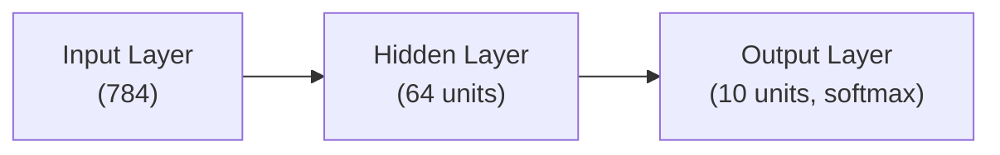

# Neural Networks From Scratch

A short, clear guide to the notebook that implements a small feed-forward neural network using NumPy.

---

## Contents

* Overview
* Quick start
* File / Notebook layout
* Simple concept diagrams (Mermaid)
* How the implementation maps to the concept (Mermaid)
* Core components
* Usage example
* Improvements & notes

---

## Overview

---

## What is a Simple Neural Network?

A **neural network** is a mathematical model inspired by how human neurons work. It takes input data, transforms it through layers, and produces an output.

Here is the idea in very simple terms:

* You give the network some **input numbers** (for example, the 784 pixel values of a 28×28 MNIST image).
* These numbers flow through one or more **hidden layers** where the network applies:

  * A **linear transformation** (multiply by weights + add bias)
  * A **non‑linear activation function** like ReLU
* Finally, the network outputs a probability distribution using **Softmax**.

A neural network learns by adjusting its weights so that its predictions move closer and closer to the correct answers.

This learning happens through:

* **Forward pass** — compute predictions
* **Loss function** — measure how wrong the prediction is
* **Backward pass (backpropagation)** — compute how weights contributed to the error
* **Parameter update** — adjust weights to reduce error next time

In this project, you implement all of these steps manually using NumPy.

---

## Overview

This project implements a basic feed-forward neural network trained on image data (MNIST-style). It uses only NumPy and matplotlib. The goal is learning: forward pass, loss computation, backpropagation, and parameter updates.

---

## Quick start

Requirements:

```
Python 3.8+
numpy
matplotlib
```

Basic usage (from the notebook):

```python
X_train = load_mnist_images('train-images-idx3-ubyte').astype('float32') / 255.0
Y_train = load_mnist_labels('train-labels-idx1-ubyte')
X_train = X_train.T  # -> shape (features, m)

nn = NeuralNetwork([784, 64, 10])
nn.train(X_train, Y_train, epochs=30, learning_rate=0.1)
```

---

## File / Notebook layout

* **Data loaders**: `load_mnist_images`, `load_mnist_labels` (read IDX format)
* **Activations**: `relu`, `relu_prime`, `softmax`, (`sigmoid` available)
* **NeuralNetwork** class: init, forward, backward, update, train, test
* **Utilities**: `one_hot`, `compute_loss`, `compute_accuracy`, plotting helpers

---

## Simple concept diagram

A minimal mermaid diagram showing concept of a small neural network (input, one hidden, output):



This diagram shows the standard flow: input features → hidden activations → output probabilities.

---

## How the implementation maps to the concept

A simple mermaid diagram that links conceptual pieces to code components:

```mermaid
flowchart LR
  Data["Raw IDX files"] --> Loader["load_mnist_* functions"]
  Loader --> Preprocess["Normalize & transpose"]
  Preprocess --> NN["NeuralNetwork class"]
  NN --> Forward[forward_propagation]
  Forward --> Loss["compute_loss (cross-entropy)"]
  Loss --> Backward[backward_propagation]
  Backward --> Update["update_parameters (SGD)"]
  Update --> Metrics["compute_accuracy & plotting"]
```



This maps each conceptual step to the function or method in the notebook.

---

## Core components

* **Data loaders** — read binary IDX files and return arrays. After loading, convert to `float32`, divide by 255, and transpose to shape `(features, m)`.

* **Activations** — ReLU in hidden layers, Softmax for the final layer. Softmax is implemented with a numerically stable shift (subtract max before exponentiating).

* **NeuralNetwork class** — holds `weights` and `biases` (lists or dict). Key methods:

  * `__init__(layers)` — initialize weights with a simple Xavier rule and zero biases.
  * `forward_propagation(X)` — compute `z` and `a` for each layer.
  * `backward_propagation(X, Y)` — compute gradients using analytic derivatives.
  * `update_parameters(lr)` — apply gradient step.
  * `train(X, Y, epochs, lr)` — run epochs and log loss/accuracy.

* **Loss & metrics** — categorical cross-entropy and accuracy (argmax vs labels).

---

## Usage example

```python
from nn_module import load_mnist_images, load_mnist_labels, NeuralNetwork

X_train = load_mnist_images('train-images-idx3-ubyte').astype('float32') / 255.0
Y_train = load_mnist_labels('train-labels-idx1-ubyte')
X_train = X_train.T

nn = NeuralNetwork([784, 64, 10])
n.train(X_train, Y_train, epochs=50, learning_rate=0.05)
```

---

## Improvements & notes

* Use mini-batching instead of full-batch updates for speed and memory.
* Add Adam optimizer for faster convergence.
* Add validation split and early stopping.
* Add L2 regularization or dropout to avoid overfitting.
* Consider He initialization for ReLU hidden layers.

---
